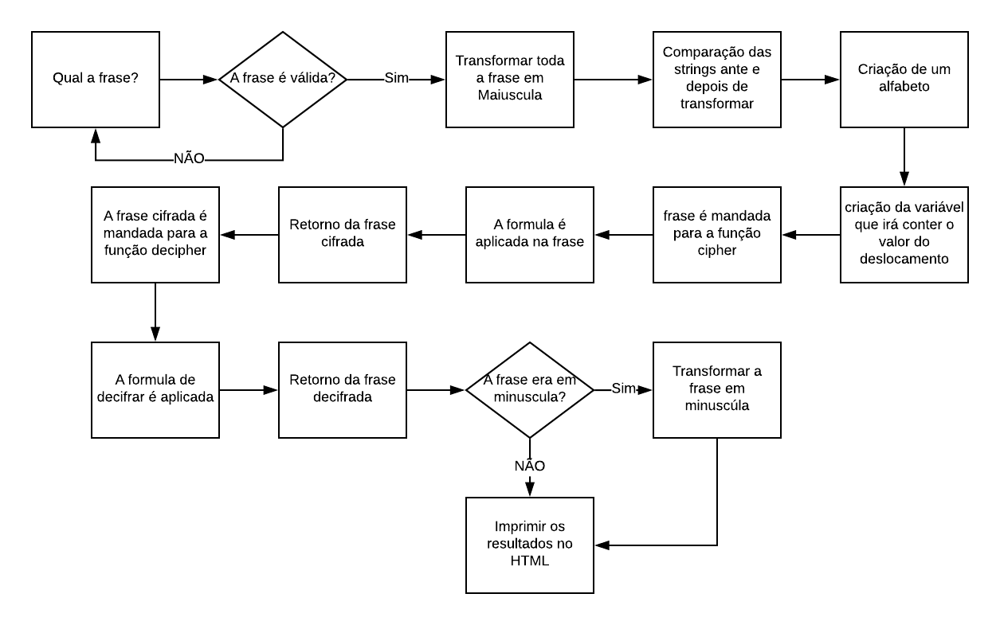

# cifra-cesar
Decodificador e codificador da Cifra de Cesar usando JavaScript

Esse foi um exercicio proposto no BootCamp Laboratória, no primeiro sprint, para aplicar os conhecimentos até então aprendidos de JavaScript.

**** Fluxograma da Aplicação ****

